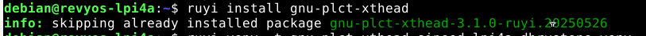
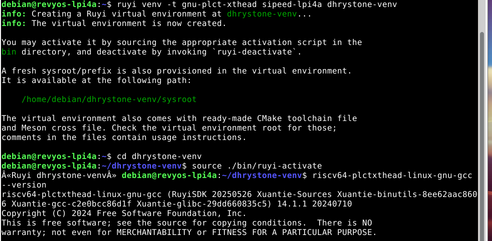
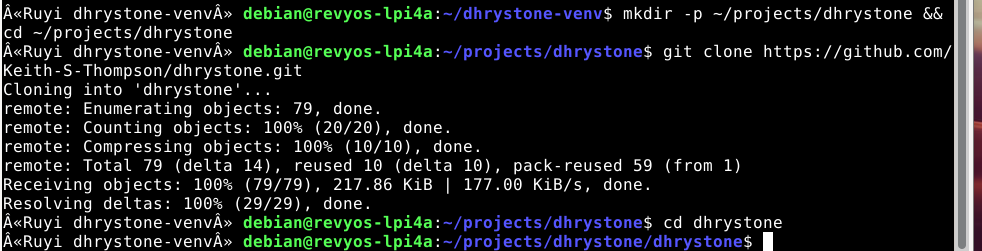
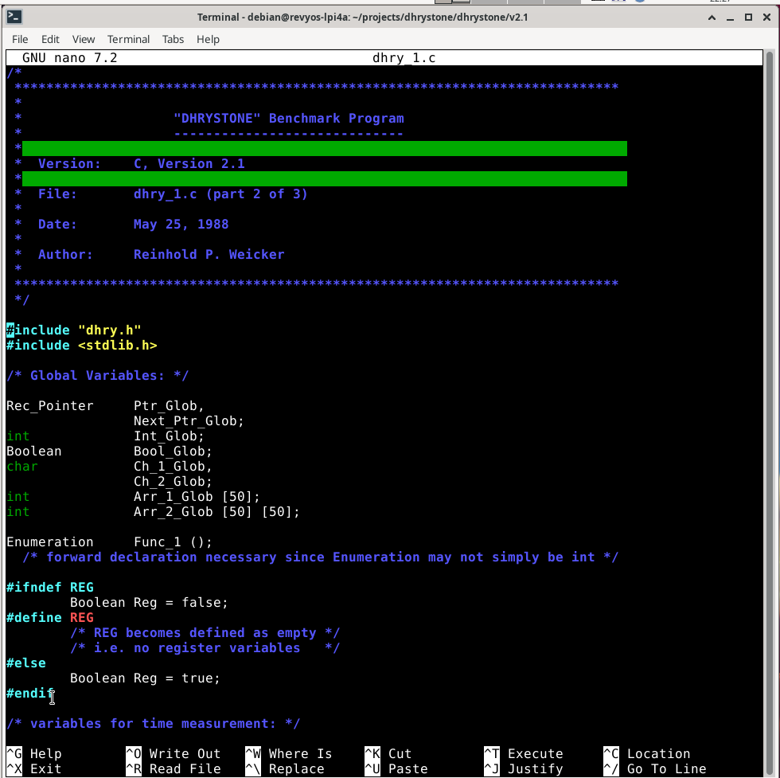
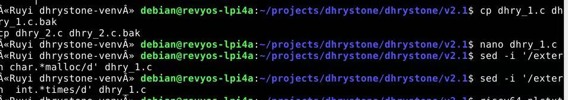
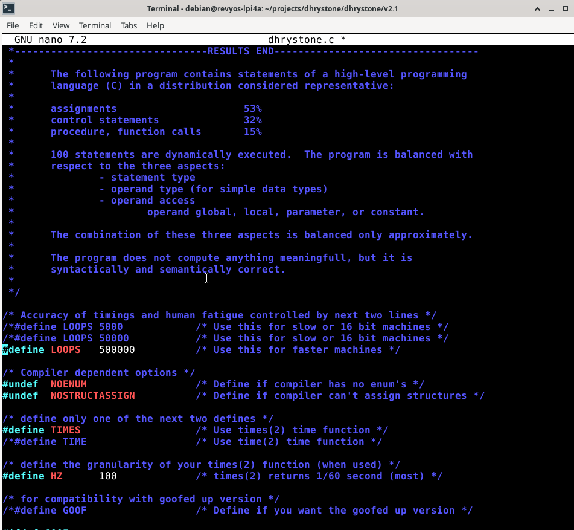
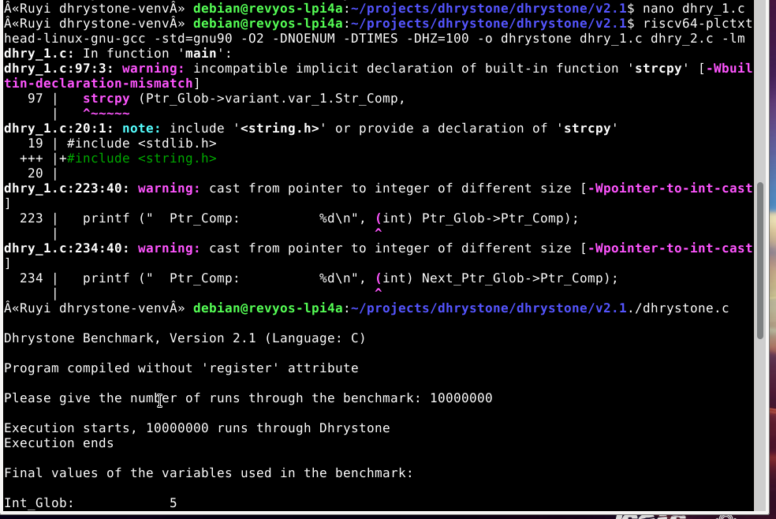
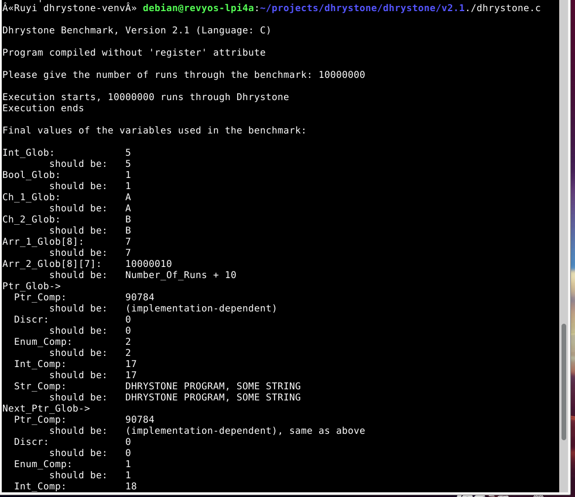

# 在 LicheePi 4A 上运行 Dhrystone 基准测试

## 硬件环境

本教程基于以下硬件环境：

- **目标设备**：LicheePi 4A 开发板
- **处理器架构**：RISC‑V 64 位
- **操作系统**：RevyOS（基于 Debian 的 RISC‑V 发行版）

确保开发板已正常启动，并可通过 SSH 或串口终端访问。

## RuyiSDK 环境搭建

本示例使用 RuyiSDK 提供的交叉编译工具链在主机上编译后部署。

#### 1. 更新 Ruyi 索引并安装工具链

更新 Ruyi 的软件源索引，并安装 RISC‑V 工具链。

```bash
ruyi update
ruyi install gnu-plct-xthead
```



#### 2. 创建并激活 Ruyi 虚拟环境

创建一个独立的虚拟环境，并激活它。这样可以避免污染系统全局环境。

```bash
# 创建虚拟环境，命名为 dhrystone-venv，使用 sipeed-lpi4a profile
ruyi venv -t gnu-plct-xthead sipeed-lpi4a dhrystone-venv

# 进入虚拟环境目录
cd dhrystone-venv

# 激活虚拟环境
source ./bin/ruyi-activate
```

激活后，终端提示符会变为 `(dhrystone-venv) user@host:~$`，表示当前处于虚拟环境中。此时使用的 `gcc`、`make` 等命令均指向虚拟环境内的工具链。

验证工具链：

```bash
riscv64-plctxthead-linux-gnu-gcc --version
```



## 编译和运行

### 1. 获取 Dhrystone 源码

推荐使用 Keith-S-Thompson 维护的 Dhrystone 版本，它包含了完整的 Makefile 和计时支持。

```bash
# 创建工作目录（在虚拟环境内）
mkdir -p ~/projects/dhrystone && cd ~/projects/dhrystone

# 克隆仓库
git clone https://github.com/Keith-S-Thompson/dhrystone.git
cd dhrystone
```

进入最常用的 v2.1 目录：

```bash
cd v2.1
```



### 2. 编译 Dhrystone

### 2.1 使用 nano 添加缺失的头文件

首先用` nano `打开 `dhry_1.c`：

```bash
nano dhry_1.c
```

使用键盘方向键将光标移动到 `#include "dhry.h"` 这一行的**下方**（通常是第 18 行或第 19 行附近）。然后在新的一行中依次输入以下内容：

```c#
#include <stdlib.h>
```

添加完成后，文件开头部分应类似于：

```c#
#include "dhry.h"
#include <stdlib.h>
```

按下 `Ctrl+O` 保存文件（按回车确认文件名），然后按 `Ctrl+X` 退出 nano。



### 2.2 删除冲突的旧式函数声明

继续使用 nano 编辑 `dhry_1.c`（或使用 sed 快速删除）。找到包含 `extern char *malloc` 和 `extern int times` 的行，将它们删除或注释掉。也可以使用以下 sed 命令自动删除：

```bash
sed -i '/extern char.*malloc/d' dhry_1.c
sed -i '/extern  int.*times/d' dhry_1.c
```



### 2.3 修正重复包含头文件的问题

如果 `dhry_1.c` 中重复包含了 `#include "dhry.h"`（例如第 18 行和第 19 行都是该包含），需删除一行。可用以下命令查看文件开头：

```bash
cat -n dhry_1.c | head -20
```

若发现重复，再次使用 `nano` 打开文件，删除多余的那一行，保存退出。

### 2.4 调整循环次数

默认循环次数为 50000，在 TH1520 上运行时间过短，会导致计时为零。建议修改为 500000 以获得数秒的运行时间。用` nano` 打开 `dhry_1.c`，找到 `#define Number_Of_Runs 50000`，将其改为：

```c#
#define Number_Of_Runs 500000
```

按下 `Ctrl+O` 保存文件（按回车确认文件名），然后按 `Ctrl+X` 退出 nano。



### 2.5 编译

使用正确的编译选项，启用 `TIMES` 计时宏并指定 `HZ=100`（Linux 系统通常为 100）：

```bash
riscv64-plctxthead-linux-gnu-gcc -std=gnu90 -O2 -DNOENUM -DTIMES -DHZ=100 -o dhrystone dhry_1.c dhry_2.c -lm
```



### 3. 运行 Dhrystone 基准测试

```bash
./dhrystone
```

程序启动后，会提示输入运行的循环次数：

```text
Please give the number of runs through the benchmark:
```

输入一个较大的数字（例如 10000000）并按回车，让测试运行足够长的时间以获得稳定结果。
为了方便自动化测试，也可以使用管道输入：

```bash
echo 10000000 | ./dhrystone
```



## 成果演示

程序运行结束后，会输出详细的性能统计信息。输出示例如下：

```text
Dhrystone Benchmark, Version 2.1 (Language: C)

Execution starts...
Execution ends (after 18967 ms)

Microseconds for one run through Dhrystone: 1
Dhrystones per Second: 1052631
VAX MIPS rating = 599
```
