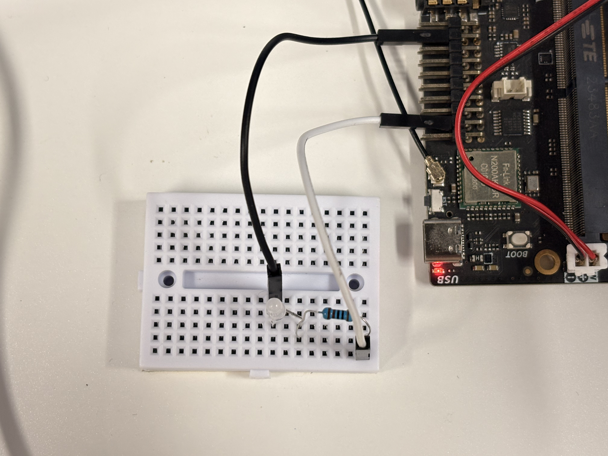

# 在 LicheePi 4A 上编译 LED Blink 示例
## 环境说明
- 硬件环境：LicheePi 4A 开发板（th1520）
- 软件环境：Debian/openEuler for RISC-V
## 一、前期准备
### 1.1 组件

- 面包板
- LED灯：3V-3.2V 直插LED
- 杜邦线：公对公杜邦线 2-3根
- 电阻（可选） ：1kΩ/220Ω 贴片/直插电阻 

### 1.2 硬件接线

按以下方式完成硬件连接，确保回路闭合：

```Plain Text
LicheePi4A GPIO1_3引脚 → LED长脚（正极） → LED短脚（负极） → LicheePi4A GND引脚
```

- 可选：在GPIO1_3与LED正极之间串联1kΩ电阻（限流保护，无电阻不影响测试）；
- 确认：杜邦线两端完全插入开发板排针和LED引脚，无松动。



## 二、创建并激活 Ruyi 虚拟环境

#### 更新 Ruyi 索引并安装工具链
```bash
ruyi update
ruyi install gnu-plct-xthead

sudo apt update && sudo apt install -y libgpiod-dev
```
#### 创建并激活 Ruyi 虚拟环境
```bash
# 创建虚拟环境，命名为 blink-venv，使用 sipeed-lpi4a profile
ruyi venv -t gnu-plct-xthead sipeed-lpi4a blink-venv
# 进入虚拟环境目录
cd blink-venv
# 激活虚拟环境
source ./bin/ruyi-activate
```
## 二、验证工具链版本
```bash
riscv64-plctxthead-linux-gnu-gcc --version
```
## 三、获取示例源码并编译
> **【厂商 Demo 调研备注】**
> * **开发语言**：**C 语言**（未涉及 Java/JavaScript/Go/Python 等其他语言）。
> * **构建工具**：**无明确的构建工具**。该实例未使用 CMake、Makefile 或 Meson 等工程化构建系统，而是采用直接调用交叉编译工具链（GCC）进行单文件编译的方式。
#### 创建工作目录并编写源码
```bash
# 创建工作目录
mkdir -p ~/ruyi_led_example && cd ~/ruyi_led_example

# 创建 C 语言源文件
nano gpio_blink.c
```
在打开的编辑器中粘贴以下完整代码（按 `Ctrl+O` 保存，按回车确认，按 `Ctrl+X` 退出）：
```c
#include <stdio.h>
#include <stdlib.h>
#include <unistd.h>
#include <gpiod.h>

int main()
{
    int i;
    int ret;

    struct gpiod_chip * chip;
    struct gpiod_line * line;

    chip = gpiod_chip_open("/dev/gpiochip1");
    if(chip == NULL)
    {
        printf("gpiod_chip_open error\n");
        return -1;
    }

    line = gpiod_chip_get_line(chip, 3);
    if(line == NULL)
    {
        printf("gpiod_chip_get_line error\n");
        gpiod_line_release(line);
    }

    ret = gpiod_line_request_output(line, "gpio", 0);
    if(ret < 0)
    {
        printf("gpiod_line_request_output error\n");
        gpiod_chip_close(chip);
    }

    printf("Starting LED blink on GPIO1_3 (num 427), press Ctrl+C to stop.\n");
    for(i = 0; i < 10; i++) 
    {
        gpiod_line_set_value(line, 1);
        printf("ON\n");
        sleep(1);
        gpiod_line_set_value(line, 0);
        printf("OFF\n");
        sleep(1);
    }

    gpiod_line_release(line);
    gpiod_chip_close(chip);

    return 0;
}
```
#### 编译
```bash
gcc gpio_blink.c -I /usr/include/ -L /usr/lib/riscv64-linux-gnu/ -lgpiod -o gpio_blink
ls
```
#### 运行程序

```bash
sudo ./gpio_blink
```

#### 输出结果

```bash
Starting LED blink on GPIO1_3 (num 427), press Ctrl+C to stop.
ON
OFF
ON
OFF
ON
OFF
ON
OFF
...
```

## 四、返回上级目录并退出工具链虚拟环境

```bash
# 返回上级目录
cd ..
# 退出 Ruyi 虚拟环境
ruyi-deactivate
```